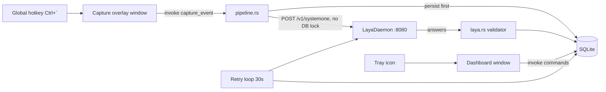

# Architecture

Tauri 2 desktop app: one Rust process owns hotkey, tray, SQLite, and the Laya HTTP client. React renders two windows from one build.

## Components

| Module | Responsibility |
|---|---|
| `lib.rs` | Wiring only: plugins (global-shortcut, autostart), tray menu, shortcut registration, DB open, retry-loop spawn |
| `db.rs` | rusqlite wrapper: migrations (`PRAGMA user_version`), taxonomy CRUD, events, classifications, `daily_counts` aggregation, settings |
| `laya.rs` | `canonical_topic` normalization, `ClassifyCtx` snapshot, prompt builders (slug keys), two-pass `classify`, threshold gates, `valid_classification` |
| `pipeline.rs` | `capture` (persist-first), `classify_pending` (lock-free HTTP), `apply_review`, `spawn_retry_loop`, window show/hide helpers |
| `commands.rs` | Tauri IPC surface: capture, review, taxonomy CRUD, events, daily counts, settings, health, diag |
| `models.rs` | serde structs shared across the boundary |

## Windows

- `main` (Dashboard): visible, 1100x760. Tabs: Heatmaps / Review / Taxonomy / Settings.
- `capture` (overlay): frameless, always-on-top, skip-taskbar, hidden until hotkey; 560x140; Enter submits, Esc hides; auto-hides ~0.9s after save confirmation.

Both windows load the same `index.html`; React picks the app by **window label** (`getCurrentWindow().label === "capture"`). URL query params are not used — the Tauri protocol handler re-encodes them.

## Why Tauri (not Electron)

The app idles in the tray all day; Electron would hold a Chromium+Node runtime permanently (~150-300 MB). Tauri uses the system WebView2 (already installed, 154.x) and Rust for the resident process: measured **~33 MB idle**. Rust also gives the retry loop a DB connection that never blocks the UI connection during HTTP calls.

## Frontend

Plain React + CSS, no state library, no chart library. The heatmap is a hand-rolled SVG calendar grid (`components/Heatmap.tsx`): week columns × 7 weekday rows, 5 intensity buckets (0 / 1-2 / 3-4 / 5-6 / 7+ distinct topics per day), GitHub-style legend, fixed window from `PROJECT_START` (Sep 2026) paged in 26-week batches (older/newer arrows, no scrolling).

Related: [[Data-Model]], [[Pipeline]], [[Laya-Integration]]