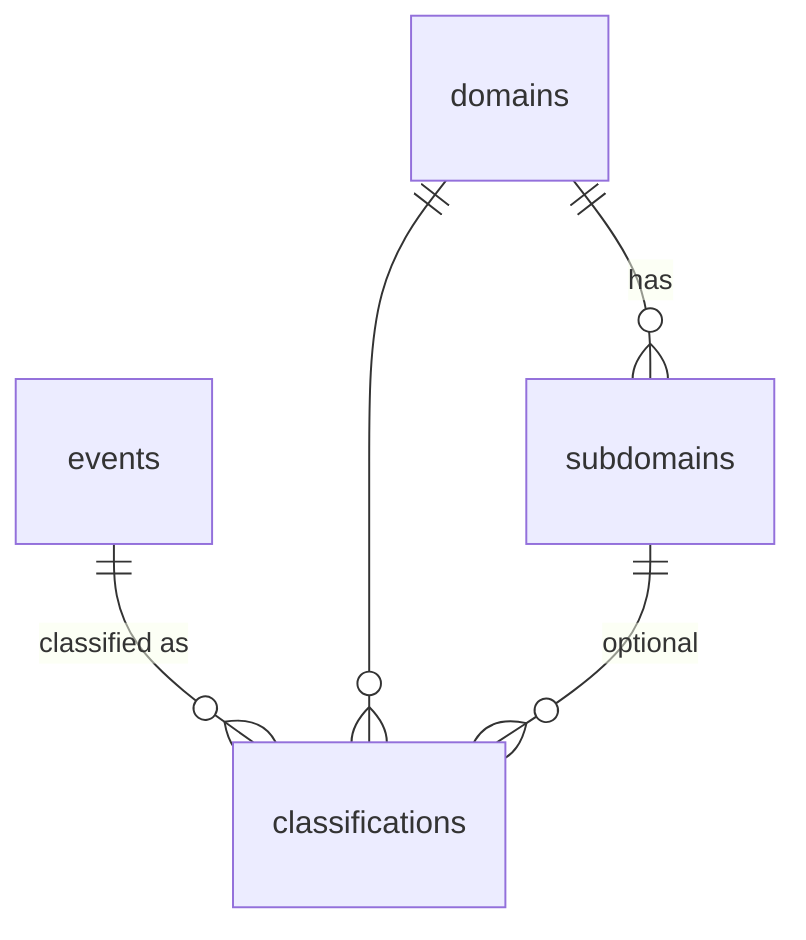
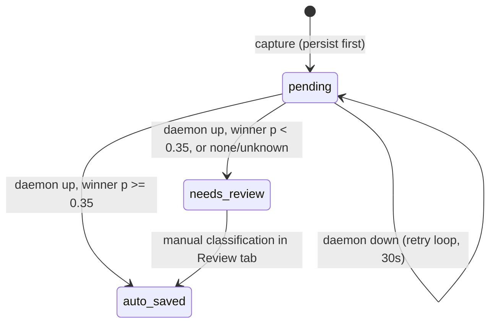

# Data Model

SQLite at `%APPDATA%\com.learngraph.app\learngraph.db`. Migrations via `PRAGMA user_version` (currently 1). WAL mode, foreign keys ON.

## Schema



- **domains** `(id, name UNIQUE, color, description, sort)` — `description` is what Laya reads during classification; a semantic definition ("Data structures and algorithms practice") measurably beats a bare name.
- **subdomains** `(id, domain_id CASCADE, name, sort, UNIQUE(domain_id, name))`
- **events** `(id, raw_text, canonical_topic, event_date, status, confidence, source, created_at)` — indexes on `event_date`, `status`.
- **classifications** `(id, event_id CASCADE, domain_id CASCADE, subdomain_id CASCADE nullable, probability, UNIQUE(event_id, domain_id, subdomain_id))` — one event, one row per domain → multi-domain heatmaps are native.
- **settings** `(key, value)` — hotkey, laya_url, thresholds, start_at_login.

## Status flow



## Derived views (never materialized)

Heatmaps aggregate on query — `daily_counts(domain_id?, from, to)`:

```sql
SELECT e.event_date, COUNT(DISTINCT e.canonical_topic) ...
FROM events e JOIN classifications c ON c.event_id = e.id
WHERE e.event_date BETWEEN ? AND ? [AND c.domain_id = ?]
GROUP BY e.event_date
```

- Intensity = **distinct canonical topics per day** (diminishing returns: 5 × "2sum" on one day counts once), buckets 1-2 / 3-4 / 5-6 / 7+.
- Overall heatmap = same query without the domain filter; domain heatmaps filter by `domain_id`. One multi-domain event contributes to every domain it was classified under.

## Canonical topics

`canonical_topic(raw)`: lowercase, keep alnum + spaces, collapse whitespace. Punctuation is **dropped, not spaced** — `"2-sum"` and `"2sum"` dedupe to the same topic. Alias resolution beyond this (LLM-assisted) is deferred; see [[Decisions]].

## Seed taxonomy (editable in-app)

DSA, System Design, Web Development, AI/ML, Aptitude, Exercise — each with subdomains and a semantic `description` used by Laya. Seeded only when the table is empty.

Related: [[Architecture]], [[Pipeline]]