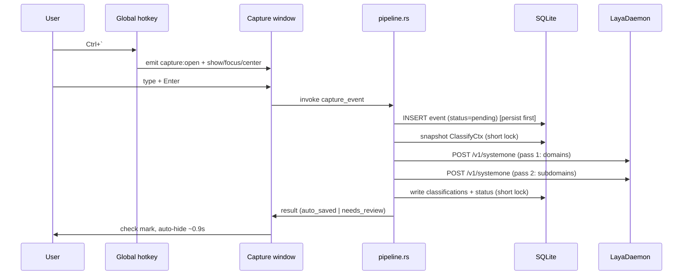

# Pipeline

Capture is optimized for seconds; classification is asynchronous and resilient.

## Capture flow

Key properties:

- **Raw text survives everything.** If the daemon is unreachable, `capture_event` returns Err ("daemon unreachable") but the event is already committed as `pending`.
- **The DB lock is never held across HTTP.** `classify_pending` snapshots settings + taxonomy into `ClassifyCtx` under a short lock, does both HTTP passes lock-free, then writes under a fresh lock. UI queries never stall behind a classification.
- The overlay closes instantly on Enter-by-default UX decision: it shows the saving state briefly; daemon latency (~2-5s warm) is absorbed by the status label, and the entry can be reviewed later regardless.

## Retry loop

`spawn_retry_loop` (spawned at `RunEvent::Ready`) opens its **own** SQLite connection (the UI connection lock is never shared) and every 30s picks up to 50 `pending` events and classifies them. First failure breaks the batch — the daemon is down; next cycle retries. Classified events emit `event:classified` so open dashboards can refresh.

## Review path

`needs_review` events appear in the Review tab. The user checks domains and picks optional subdomains; `apply_review` validates ids against the taxonomy (`valid_classification`), writes probability 1.0 rows, and flips status to `auto_saved`. Deterministic — the model is never trusted with writes.

## Concurrency notes

- Two SQLite connections exist: UI (`AppState.db`) and retry loop. Both WAL — concurrent readers fine; writers serialize briefly.
- `capture` is called from the IPC thread; `classify_pending` blocks that command only. Other commands proceed because the lock is released during HTTP.
- `ponytail:` single global mutex per connection is sufficient at personal-tracker scale; per-connection pools only if profiling demands it.

Related: [[Architecture]], [[Laya-Integration]], [[Data-Model]]